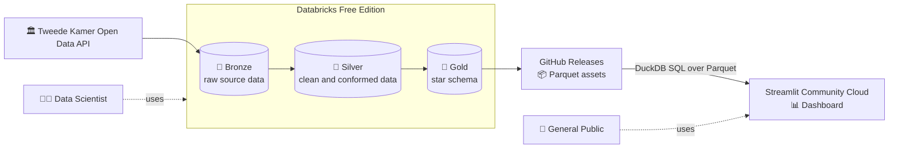

# Tweede Kamer Monitor Architecture

## Purpose and Scope

Tweede Kamer Monitor is an open-source data platform and public dashboard for exploring the work of the Dutch House of Representatives (Tweede Kamer). It turns data from the Tweede Kamer Open Data API into understandable public information and reusable analytical datasets.

The architecture has two related goals:

1. Provide a simple dashboard for people who want to understand parliamentary work, legislation, motions, meetings, documents, and voting.
2. Provide clean, documented analytical data for journalists, researchers, and data scientists who want to perform deeper analysis in SQL, Python, or R notebooks.

The dashboard is designed for the general public. Every dashboard view should include explanatory text in plain language, so users do not need prior knowledge of Dutch parliamentary procedures or domain terminology.

## Audiences and Design Goals

The primary audience is the general public. Secondary audiences include journalists, researchers, and data scientists. Advanced users can clone the repository and use Databricks or another Spark environment to work directly with the Silver and Gold layers in SQL, Python, or R notebooks.

The architecture prioritizes:

- Understandable explanations over unexplained parliamentary jargon.
- Reproducible data preparation and transparent data provenance.
- Clean analytical data with stable contracts.
- Low-cost public distribution and hosting.
- Portable technologies and open data formats.
- Small, focused components that can be operated by an open-source project.

## System Overview

The data pipeline periodically reads the SyncFeed 2.0 XML API, processes the data in Databricks Free Edition using Delta Lake, and publishes the analytical Gold data as Parquet files. The Streamlit dashboard is deployed from this repository on Streamlit Community Cloud and queries the published Parquet files through DuckDB.

The transformation environment and the dashboard hosting environment are deliberately separated. Databricks performs data engineering and analytical modeling; GitHub Releases acts as a simple public hand-off point; DuckDB performs local analytical queries inside the dashboard process.

## Medallion Architecture

The pipeline follows the [Medallion Architecture](https://docs.databricks.com/en/lakehouse/medallion.html). Data becomes more reliable and easier to consume as it moves through progressively refined layers:

- **Bronze** preserves data from the external source with minimal interpretation. It provides a durable starting point for processing and allows transformations to be rerun from source data.
- **Silver** cleans, parses, types, normalizes, and conforms the source data. It is the main analytical access layer for users who need trustworthy entity-level data without working with the source XML structure.
- **Gold** organizes data for well-defined analytical questions. It is optimized for dashboard queries and other reporting use cases.

These layers describe different responsibilities in the data process. They do not mean that every intermediate table must be shown in the dashboard: the dashboard mainly uses the Gold layer, while analysts may also work with Silver. For each layer, we document what the data contains, where it came from, and which quality checks it must pass.

## Source and Ingestion

The source is the public Tweede Kamer Open Data API at `opendata.tweedekamer.nl`, accessed through its SyncFeed 2.0 XML interface. The ingestion logic is implemented in [`pipeline/bronze/ingest_opendata.py`](pipeline/bronze/ingest_opendata.py). It is called periodically for the relevant API categories. A skiptoken is used to only 
ingest new items.

Raw source records are stored in the `workspace.tweedekamer.bronze_opendata_api` Delta table after the catalog and schema are prepared by [`pipeline/init.sql`](pipeline/init.sql). The Bronze contract retains the raw `entry` value together with the source position represented by `skiptoken` and the ingestion timestamp `ingested_at`.

If additional external data sources are added in the future, they must first be ingested into the Bronze layer. Each source should retain its original data and source metadata there before it is cleaned, combined, or transformed in the Silver and Gold layers.

Ingestion should respect the public API by using bounded requests, suitable retry behavior, and a refresh schedule that does not create unnecessary load. Failures should be observable and should not silently produce an incomplete analytical refresh.

## Silver Layer

Silver is the clean, conformed data layer for analytical work. Its responsibilities include:

- Converting source structures into typed, relational data.
- Applying consistent names, identifiers, timestamps, and null handling.
- Normalizing repeated entities and relationships.
- Preserving source identifiers and provenance so results can be traced back to the API.
- Handling corrections and changed source records.
- Applying deduplication and referential-integrity rules.
- Recording data-quality outcomes and freshness information.

New and changed source records are merged into the Silver tables. Merge keys and update rules must be defined by the data contract for each entity type, using durable source identifiers wherever possible. A merge must be idempotent: rerunning the same input should not create additional copies of a record.

Silver is intended to be useful beyond the dashboard. Journalists, researchers, and data scientists should be able to query it directly in SQL or use it from Python and R notebooks in Databricks or another compatible Spark environment.

## Gold Layer: Star Schema

Gold is a star schema designed for clear and efficient analysis. Its overall structure consists of:

- **Fact tables**, which record measurable or countable events at a documented grain, such as a vote, activity, meeting occurrence, or document event.
- **Dimension tables**, which provide descriptive context such as people, factions, dates, document types, meetings, and parliamentary subjects.
- **Conformed dimensions**, reused by multiple facts so that analyses agree on the meaning of a person, faction, date, or other shared concept.

The first analytical scope covers persons, factions, activities, documents, meetings, and voting trends. The exact collection of tables may evolve, but every fact must state its grain and every relationship must have a clear key. Gold models should favor straightforward joins and useful pre-aggregations over reproducing the source API structure.

The Gold layer is recalculated on each data refresh. The resulting tables are written as Parquet files and published as assets in GitHub Releases. The previous release assets are overwritten by the latest data, so historical dataset versioning is outside the scope of this architecture. A small metadata manifest should accompany the assets and record the refresh time, source coverage, row counts, schema information, and data-quality result.

## Parquet Publication and DuckDB

Parquet is the exchange format between the data pipeline and the dashboard. Gold tables are exported as Parquet files and made available through the latest GitHub Release. The dashboard downloads or accesses those assets and queries them with DuckDB.

This arrangement provides several benefits:

- Parquet is a compact, columnar format suited to analytical scans.
- Column pruning and compression reduce the amount of data read for dashboard queries.
- Files are portable across Python, R, SQL engines, Spark, and local data tools.
- GitHub Releases provide a simple, public distribution mechanism without operating a database server.
- The transformation environment can be separated from the presentation environment.
- DuckDB supports expressive SQL and can query Parquet directly inside the Streamlit process.
- A release asset and metadata manifest make a refresh reproducible enough to diagnose what the dashboard displayed.

The release process should publish complete, internally consistent assets. The dashboard should not mix files from different refreshes. A temporary download location and an atomic replacement of the local dataset help prevent partial refreshes from being queried.

## Streamlit Hosting and Caching

The Streamlit dashboard is deployed from this repository on [Streamlit Community Cloud](https://streamlit.io/cloud). The application should use caching deliberately because Streamlit reruns the script when users interact with widgets. Without caching, each interaction could recreate DuckDB connections, download the same Parquet files, and repeat identical queries.

Caching responsibilities should be separated:

- Cache downloaded Parquet assets or a locally prepared dataset with a time-to-live and an explicit refresh strategy.
- Cache a DuckDB connection or other shared resources using the resource-cache mechanism when they are safe to share.
- Cache deterministic query results or relatively static reference data using the data-cache mechanism.
- Invalidate caches when the release metadata indicates that a new dataset has been published.
- Keep cached objects bounded so a growing number of queries does not exhaust memory.

Caching improves response time, reduces GitHub and compute traffic, and makes the dashboard feel stable during repeated interaction. It does not remove capacity risks. Many concurrent users may cause repeated cold starts, CPU contention, memory pressure, simultaneous downloads, slow queries, or rate-limit pressure on the hosting platform and release asset source. A cache that is too long-lived can also show stale parliamentary information; a cache that is too broad can return a result for the wrong filter combination.

The dashboard should mitigate these risks by using bounded result sets, sensible filters, pre-aggregated Gold data, efficient DuckDB queries, connection reuse, cache TTLs, graceful loading and error states, and minimal repeated network access. Load and memory behavior should be checked with representative concurrent usage before treating the public deployment as reliable at larger scale. If Streamlit Community Cloud becomes unsuitable because of capacity or availability constraints, [Hugging Face Spaces](https://huggingface.co/spaces) is the fallback hosting option. The same repository-based Streamlit application and Parquet/DuckDB boundary should remain usable where possible.

## Public Usability Requirements

The dashboard must be approachable to people unfamiliar with the Tweede Kamer. Each dashboard view should include concise explanatory text covering what is shown, why it matters, and how to interpret it. The interface should:

- Explain terms such as *motie*, *wetsvoorstel*, *stemming*, *fractie*, *commissie*, and *vergadering* in plain language.
- Explain the basic path from proposal to debate, vote, and decision where relevant.
- Use clear labels, descriptive chart titles, units, legends, and source references.
- Provide sensible defaults and allow users to start exploring without configuring many controls.
- Use progressive disclosure so advanced detail is available without overwhelming first-time users.
- Handle empty results, loading, stale data, and failures with useful messages.
- Show data freshness and source provenance.
- Keep text and controls readable on common desktop and mobile viewports.
- Use accessible color choices, sufficient contrast, and alternatives to color-only distinctions.
- Avoid presenting correlations or counts as causal explanations.

The dashboard is an explanatory public interface, not the only analytical interface. Users who need more detailed or repeatable analysis are encouraged to clone the repository and work directly with Silver and Gold in SQL, Python, or R notebooks.

## Coding and Data Standards

The pipeline and analytical models should follow these conventions:

- Follow the [PEP 8](https://peps.python.org/pep-0008/) style guide for Python code.
- Use singular, lowercase Dutch words in `snake_case` for table names and column names. Apply the same convention consistently across all layers.
- Prefer meaningful names over unexplained abbreviations.
- Use stable source identifiers for keys and document any surrogate-key strategy.
- Use consistent types for dates, timestamps, booleans, numeric measures, and text.
- Define the grain of every fact and the intended cardinality of important relationships.
- Keep transformation logic deterministic and idempotent where possible.
- Prefer portable SQL, Python, standard Spark DataFrame APIs, and open file formats.
- Write all SQL keywords in uppercase, such as `SELECT`, `FROM`, `WHERE`, `JOIN`, and `GROUP BY`. Table names, column names, and other identifiers follow the lowercase Dutch naming convention above.

Every Silver and Gold table and every column in those layers must have a comment written in Dutch. The comment should describe its business meaning, provenance, units where applicable, nullability or expected values, and transformation semantics. Comments are part of the data contract: they support public documentation, help notebook users and future maintainers interpret data without reading all transformation code, and help the LLM agent in Databricks build accurate queries.

The standards apply to the overall layer structure and data contracts; the architecture does not prescribe an exhaustive inventory of independent tables.

## Quality, Operations, and Security

Refreshes should include checks appropriate to each layer, including XML parsing success, required fields, uniqueness, referential integrity, expected row-count changes, freshness, valid domains, and completeness of the Gold export. Quality results should be included in the refresh metadata manifest and should prevent an obviously invalid dataset from being published.

Operational behavior should include:

- Periodic scheduling of API ingestion.
- Bounded retries and respectful request pacing.
- Idempotent ingestion and Silver merges.
- Handling and reporting of malformed or unexpected source data.
- Explicit schema-evolution decisions when the API changes.
- Logging of refresh start, completion, row counts, failures, and publication results.
- Safe configuration of endpoints and runtime settings.
- No credentials or secrets committed to the repository.
- Appropriate access controls for Databricks workspaces and publishing credentials.

Databricks Free Edition is the initial processing environment. The design intentionally avoids Databricks-specific Spark features such as declarative pipelines. Transformations should rely on portable Spark DataFrame APIs, standard SQL, Python, and open formats so that the workload can move to another data platform or eventually to a fully open-source stack with limited redesign.

## Decisions and Limitations

- The dashboard is hosted on Streamlit Community Cloud from the repository.
- Hugging Face Spaces is the backup dashboard-hosting option.
- Gold data is recalculated on every refresh and published as the latest Parquet snapshot through GitHub Releases.
- The previous release assets are overwritten; historical dataset versioning is not required.
- DuckDB is used for local analytical queries over Parquet rather than a continuously running database service.
- The architecture depends on the availability and structure of the public Tweede Kamer API.
- Hosting limits, API limits, GitHub asset limits, and the cost or capacity of the processing environment constrain scale.
- Public interpretations must remain grounded in the source data and should make uncertainty and data limitations visible.

## Glossary

- **Tweede Kamer**: the Dutch House of Representatives.
- **Fractie**: a parliamentary group, usually organized around a political party.
- **Motie**: a motion in which members ask the government to take an action or express a view.
- **Wetsvoorstel**: a legislative proposal.
- **Stemming**: a vote.
- **Vergadering**: a parliamentary meeting or sitting.
- **Commissie**: a parliamentary committee.
- **Bronze, Silver, Gold**: progressively refined data layers in the Medallion Architecture.

## Maintaining This Document

Update this file when a change affects system boundaries, layer responsibilities, data contracts, publication, hosting, security, or a major technology decision. Keep descriptions aligned with the code, table metadata, release process, and dashboard behavior. Small implementation details belong near the relevant code; this document should remain a concise explanation of the architecture and its enduring decisions.
