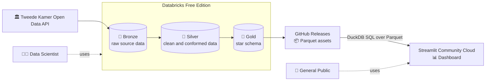

# Tweede Kamer Monitor Architecture

## Purpose

Tweede Kamer Monitor is an open-source data pipeline and public dashboard for exploring the work of the Dutch House of Representatives (Tweede Kamer). It turns data from the Tweede Kamer Open Data API into information that is useful to the public and to people doing research.

The project has two goals:

1. Give the public a simple way to explore parliamentary work, legislation, motions, meetings, documents, and voting.
2. Provide clean, documented data for journalists, researchers, and data scientists who want to work in SQL, Python, or R notebooks.

## Architecture

### Audiences and Design Goals

The main audience is the general public. Journalists, researchers, and data scientists are important secondary audiences. They can clone the repository and use Databricks or another Spark environment to work directly with the Silver and Gold layers.

The architecture prioritizes:

- Explain parliamentary concepts instead of leaving readers to decode jargon.
- Make data preparation reproducible and the source of each dataset clear.
- Keep analytical data clean and its contracts stable.
- Use low-cost hosting and public distribution.
- Prefer portable technologies and open formats.
- Keep components small enough for an open-source project to operate.

### System Overview

The pipeline periodically reads the SyncFeed 2.0 XML API, processes the data in Databricks Free Edition with Delta Lake, and publishes the Gold data as Parquet files. The Streamlit dashboard runs from this repository on Streamlit Community Cloud and queries those files through DuckDB.

The transformation and hosting environments are separate on purpose. Databricks handles data engineering and modeling, GitHub Releases distributes the files, and DuckDB queries them inside the dashboard process.

### Data Layers

The pipeline follows the [Medallion Architecture](https://docs.databricks.com/en/lakehouse/medallion.html):

- **Bronze** stores source data with minimal interpretation.
- **Silver** cleans and conforms the data for analytical use.
- **Gold** organizes the data for dashboard and reporting queries.

The layers describe responsibilities in the data process, not separate dashboard views. The dashboard mainly uses Gold, while analysts may also use Silver. Each layer documents its contents, source, and required quality checks.

### Source and Ingestion

The source is the public Tweede Kamer Open Data API at `opendata.tweedekamer.nl`, accessed through its SyncFeed 2.0 XML interface. The ingestion logic lives in [`pipeline/bronze/ingest_opendata.py`](pipeline/bronze/ingest_opendata.py) and runs periodically for the relevant API categories. A skiptoken ensures that only new items are ingested.

Raw source records are stored in the `workspace.tweedekamer.bronze_opendata_api` Delta table after [`pipeline/init.sql`](pipeline/init.sql) prepares the catalog and schema. The Bronze contract keeps the raw `entry`, the source position (`skiptoken`), and the ingestion timestamp (`ingested_at`).

Any future external sources must also enter through Bronze. Their original data and source metadata should remain there before the data is cleaned, combined, or transformed in Silver and Gold.

Ingestion should respect the public API with bounded requests, suitable retries, and a schedule that does not create unnecessary load. Failures must be visible and must not silently produce an incomplete refresh.

### Publication

Parquet is the exchange format between the pipeline and the dashboard. Gold tables are exported as Parquet files, published through GitHub Releases, and queried by the dashboard with DuckDB.

Each release replaces the previous assets, so historical dataset versioning is outside the scope of this architecture. A small manifest should record the refresh time, source coverage, row counts, schema, and data-quality result.

This arrangement provides several benefits:

- Parquet is compact and columnar, so it works well for analytical scans.
- Column pruning and compression limit the data read by dashboard queries.
- The files work across Python, R, SQL engines, Spark, and local data tools.
- GitHub Releases provide public distribution without requiring a database server.
- Databricks and the dashboard can be operated independently.
- DuckDB can run expressive SQL over Parquet inside the Streamlit process.
- Release metadata makes it possible to diagnose what the dashboard displayed.

The release process should publish complete, consistent assets, and the dashboard should never mix files from different refreshes. Downloading to a temporary location and replacing the local dataset atomically helps prevent partial refreshes from being queried.

### Dashboard

#### Hosting and Caching

The Streamlit dashboard is deployed from this repository on [Streamlit Community Cloud](https://streamlit.io/cloud). It should use caching because Streamlit reruns the script when users interact with widgets. Otherwise, each interaction could recreate DuckDB connections, download the same files, and repeat identical queries.

#### Public Usability

The dashboard should work for people who are unfamiliar with the Tweede Kamer. Each view should briefly explain what it shows, why it matters, and how to read it. The interface should:

- Explain terms such as *motie*, *wetsvoorstel*, *stemming*, *fractie*, *commissie*, and *vergadering* in plain language.
- Explain the basic path from proposal to debate, vote, and decision where relevant.
- Use clear labels, descriptive chart titles, units, legends, and source references.
- Provide sensible defaults and allow users to start exploring without configuring many controls.
- Use progressive disclosure so advanced detail is available without overwhelming first-time users.
- Handle empty results, loading, stale data, and failures with useful messages.
- Show data freshness and source provenance.
- Keep text and controls readable on common desktop and mobile viewports.
- Use accessible color choices, sufficient contrast, and alternatives to color-only distinctions.
- Avoid presenting correlations or counts as causal explanations.

The dashboard is a public explanation layer, not the only way to analyze the data. Users who need more detail or repeatability can clone the repository and work with Silver and Gold in SQL, Python, or R notebooks.

## Standards

### Coding and Data

The pipeline and analytical models follow these conventions:

- Follow the [PEP 8](https://peps.python.org/pep-0008/) style guide for Python code.
- Use singular, lowercase Dutch words in `snake_case` for table names and column names. Apply the same convention consistently across all layers.
- Prefer meaningful names over unexplained abbreviations.
- Use stable source identifiers for keys and document any surrogate-key strategy.
- Use consistent types for dates, timestamps, booleans, numeric measures, and text.
- Define the grain of every fact and the intended cardinality of important relationships.
- Keep transformation logic deterministic and idempotent where possible.
- Prefer portable SQL, Python, standard Spark DataFrame APIs, and open file formats.
- Write all SQL keywords in uppercase, such as `SELECT`, `FROM`, `WHERE`, `JOIN`, and `GROUP BY`. Table names, column names, and other identifiers follow the lowercase Dutch naming convention above.

### Data Contracts

Silver merges should use durable source identifiers, defined merge keys, and idempotent update rules. Gold uses a star schema with documented fact-table grains and dimensions for descriptive context. Silver should be usable directly in SQL, Python, or R; Gold is recalculated and published on each refresh.

Every Silver and Gold table and column must have a Dutch comment. It should describe the business meaning, provenance, units where relevant, nullability or expected values, and transformation semantics. These comments are part of the data contract: they document the data for users and maintainers and help the LLM agent in Databricks build accurate queries.

The standards apply to the overall layer structure and data contracts; the architecture does not prescribe an exhaustive inventory of independent tables.

## Operations

Refreshes should include checks appropriate to each layer, including XML parsing, required fields, uniqueness, referential integrity, expected row-count changes, freshness, valid domains, and completeness of the Gold export.

### Refresh and Reliability

Operations should include:

- Periodic scheduling of API ingestion.
- Bounded retries and respectful request pacing.
- Idempotent ingestion and Silver merges.
- Handling and reporting of malformed or unexpected source data.
- Explicit schema-evolution decisions when the API changes.
- Logging of refresh start, completion, row counts, failures, and publication results.
- Safe configuration of endpoints and runtime settings.
- No credentials or secrets committed to the repository.
- Appropriate access controls for Databricks workspaces and publishing credentials.

### Portability and Security

Databricks Free Edition is the initial processing environment. The design avoids Databricks-specific Spark features such as declarative pipelines. Transformations should use portable Spark DataFrame APIs, standard SQL, Python, and open formats so the workload can move to another platform or a fully open-source stack with limited redesign.

## Glossary

- **Tweede Kamer**: the Dutch House of Representatives.
- **Fractie**: a parliamentary group, usually organized around a political party.
- **Motie**: a motion in which members ask the government to take an action or express a view.
- **Wetsvoorstel**: a legislative proposal.
- **Stemming**: a vote.
- **Vergadering**: a parliamentary meeting or sitting.
- **Commissie**: a parliamentary committee.
- **Bronze, Silver, Gold**: progressively refined data layers in the Medallion Architecture.
